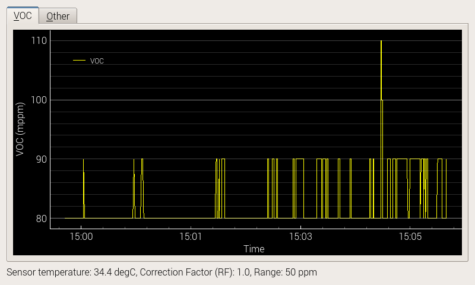
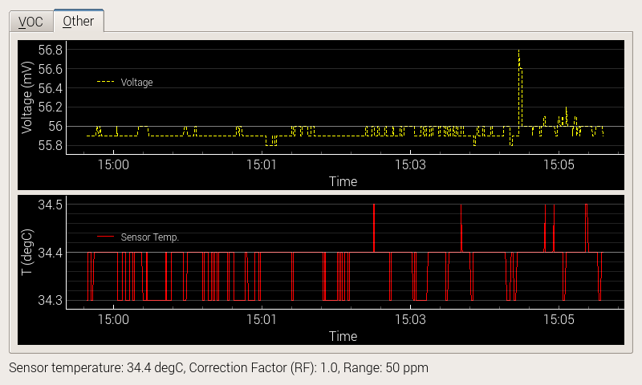

# RS485logger

## Description

This application is written to monitor diferent variables from an RS485 capable device.

Based on the [Waveshare USB to RS485B](https://www.waveshare.com/wiki/USB_TO_RS485_(B))

Currently supporting these sensors: 
- Truebner AquaFlex and SMT100 soil mosture sensors (see e.g. [SMT100 Instruction Manual](https://www.truebner.de/assets/download/Anleitung_SMT100_V1.1.pdf)).
- Ionscience [Falco Pumped Gas Detector series](https://ionscience.com/en/products/products-falco-fixed-voc-gas-detector-pumped-0-10ppm/) ([Instruction Manual](./config_templates/falco/Falco_Pumped_DE_Rev1.2.pdf)).

Tested using python3.9.2 on a Raspberry Pi 4B

## Installation

1. Clone the repository. In this example we are clonning to `/logger`):   
   ```
   sudo git clone https://gitlab.fhnw.ch/alejandrokeller/rs485logger.git /logger
   ```
2. Install requirements:

   ```
   cd /logger
   sudo pip install -r requirements.txt
   ```
3. Conect the  usb to RS485B converter. In the raspberry pi, the usb to RS485B converter works using the default (already installed) driver. You can find out the converter serial port by running the following command before and after connecting the adapter:

   ```
   ls /dev/tty*
   ```
   If you want to test the device, ycou can use, e.g., [minicom](https://www.waveshare.com/wiki/Raspberry_Pi_Tutorial_Series:_Serial):

   ```
   minicom -b 9600 -D /dev/ttyUSB0
   ```
   - -D Specify the device, overriding the value given in the configuration file. The followed device, `/dev/ttyUSB0`, is the serial device specified by -D
   - The baud rate of serial is set to 115200 by default, which can be changed by `-b 9600`. You can read the detailed manual with the command man minicom

4. Create the the data and logging directories:
   ```
   mkdir  ~/logger/ ~/logger/logs
   ```
5. Create a `/logger/config.ini`. You can simply copy and modify an appropiate `config.ini` file located at in the `config_templates` to the logger directory (in this example use `/logger/config.ini` as destitantion).

   Variables in `config.ini`:
   * `PORT: '/dev/ttyUSB0'` (or the serail address from step 3)
   * `ADDRESS: 3` (or the MODBUS address of the sensor)
   * `LOGS_PATH: '/home/pi/logger/logs'` (or the directory created in step 4)
   * `DATA_PATH: '/home/pi/logger/data'` (or the directory created in step 4)
   * `HOST_NAME: '127.0.0.1'` (The ip used for the gui intgerface. Leave it like this if the logger and the gui are on the same computer)
   * `HOST_PORT: 10000` (The port for data transmission to the gui. 10000 is usually free. Some firewalss may block this port if transmitting to another computer. Check your system documentation)
   * `BUFFER: 120` (Lines to be captured before writting to the data file. Example: 120 for a system with 2 Hz rate to write only once a minute)
   * `DATAFILE: 'rs485data'` (base name for datafile. Date and time of creation will be appended)
   * `EXTENSION: '.csv'` (extension for the datafile. Per default the system creates columns separated with tab)
   * `JSON_CONFIG: '/logger/config_templates/falco/config.falco.json'` (file for formating the GUI window)

   The last variable points to a file containing the configuration of the GUI. Do not modify the example json files, as they are linked to this repository. It is better to create a new json file if you need to modify the settings. Afterwards, point the `JSON_CONFIG`variable to the newly created file.

6. Create a bash script to start logger and gui (e.g. `nano ~/Desktop/run_logger.sh`). Then write the following commands (substitute the location with the installation directory and the log file directory):
   ```
   #!/usr/bin/env bash
   python /logger/logger.py 2>> /home/pi/logger/logs/logfile.txt &
   python /logger/gui.py 2>> /home/pi/logger/logs/logfile.txt &
   ```
   Make the script executable using `chmod +x ~/Desktop/run_logger.sh`. Now you can double click on the icon to start logging and displaying the data. 
   By usig the `2>>` log messages are redirected from `stderr` and appended to a file.

## Usage

Make sure that your sensor is connected to the logging computer through the RS485B interface and that is properly set to trasmit data. If you follow the installation procedure, starting the program is straightforward: double click the `run_logger.sh` script on the desktop or use a terminal window to type the command `~/Desktop/run_logger.sh`. The script starts the logger and the GUI, and log errors and messages to the text file `/home/pi/logger/logs/logfile.txt` (or an alternative file defined during the installation).
Alternativelly, run the scripts separatelly in two different terminal windows using the commands `python /logger/logger.py` and 
`python /logger/gui.py`. Note that by running the scripts without redirection, the errors and messages will be shown on the default `stderr` file (usually the same terminal window).

The logger scripts operates saves data autonomously to csv files whitout requiring the GUI to be active. The GUI, however, cannot operate if the logger is not running. The GUI script will wait for the logger to send data before displaying the interface. The GUI script can be safely terminated (`Ctrl+C`) and restarted several times without data loss from the logger side. The logger program will create a new csv file at startup or at midnight. The log files can be accessed through the directory defined in the `DATA_PATH` variable of the `config.ini` (in this example `/home/pi/logger/data`).

It is possible to run the logger and GUI scripts in different computers. This is done by selecting the appropriate host (i.e. the ip/address of the computer where the data will be streamed) in the `config.ini` file. Refer to the documentation for the [socket python library](https://docs.python.org/3/library/socket.html) for more information.

## JSON_CONFIG file

The `JSON_CONFIG` file defines the appearance of GUI. You can choose to have one or more tabs displaying variables in graphics. Additionally, it is posible to display information text with below the tabs. This is the example file prepared for the falco VOC instrument (i.e. `config.falco.json`):
```
{"buffer": 3000,
"variables": ["VOC", "Voltage", "T", "RF", "Range"],
 "plots": [
     {"var": "VOC", "tab": 0, "plot": 0, "pen": 0, "label": "VOC"},
     {"var": "Voltage", "tab": 1, "plot": 0, "pen": 1},
     {"var": "T", "tab": 1, "plot": 1, "pen": 2, "label": "Sensor Temp."}],
 "tabslabels": ["&VOC","&Other"],
 "infotext": {"text": "Sensor temperature: {} degC, Correction Factor (RF): {}, Range: {} ppm",
              "variables": ["T","RF","Range"]}}
```

The JSON dictionaries are organized as following:

* `"buffer"`: buffer size: number of datapoints to display in the GUI interface
* `"variables"`: subset of variables that will be kept for displaying. 
* `"plots"`: list of variables and plots to display. Each plot is specified by the following dictionary:
   * `"var"`: Name of the variable.
   * `"tab"`: Number of the tab where the plot will be shown.
   * `"plot"`: Number of the plot within the relevant tab (you can display several variables per plot and several plots per tab) 
   * `"pen"`: Style of the line. Currently only 4 pens defined (0 -> solid yellow, 1 -> dash yellow, 2 -> solid red, 3 -> dash red)
   * `"label"`: (optional) Name that will be used to identify the curve. Omit this to use the variable name.
* `"tabslabels"`: text to display on top of each tab. Numbers are asigned for the tabs without names.
* `"infotext"`: Information text displayed at the bottom of the GUI. 
   * `"text"`: Displayed text (same format as the python [`str.format()`](https://docs.python.org/3/tutorial/inputoutput.html#the-string-format-method) method for strings).
   * `"variables"`: name of the variables to integrate into the text.

The `config.falco.json` produces these two tabs:




 
## Falco driver

It is possible to access all the registers defined in the RS485B interface of the Falco VOC sensor. Currently, the following variables are logged:

* `'VOC'`: Gas concentration.
* `'Voltage'`: Sensor voltage in mV.
* `'T'`:  Sensor temperature in degC.
* `'RF'`: Sensor response factor.
* `'Range'`: Sensor range (10, 50, 1000, or 3000).
* `'Cal100'`: Cal 100 value (default 500).
* `'Cal3000'`: Cal 100 value (default 3000).

All these variables can thus be displyed in the GUI interface. Refer to the [Falco sensor manual](./config_templates/falco/Falco_Pumped_DE_Rev1.2.pdf) for more information.

## Support
Please contact me under alejandro.keller@fhnw.ch for feedback or issues with this repository.
